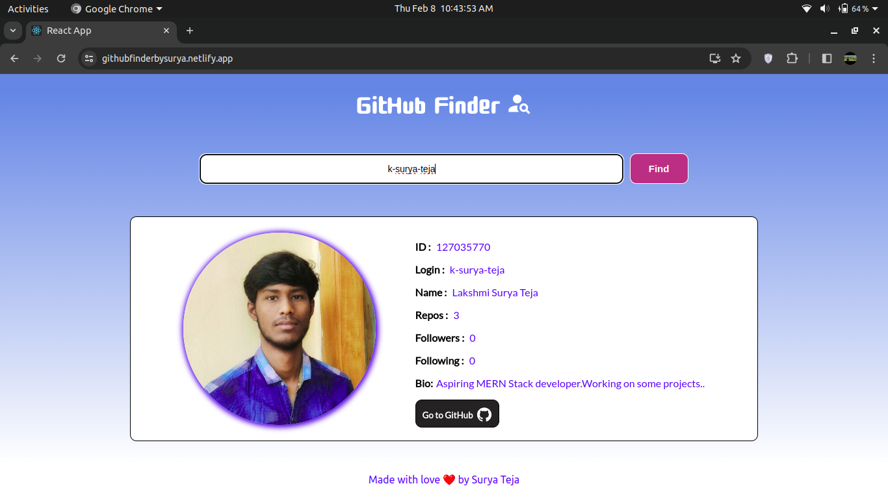

# GitHub Finder

GitHub Finder is a web application built using React.js that allows users to search for GitHub accounts by username and view details of those accounts.
Check out on live : <a href='https://www.githubfinderbysurya.netlify.app' target="_blank">githubfinder.com</a>

### 1. Starting of the App

### 2. Input and Displayed Output

### 3. No Search Found

## Features

- **Search GitHub Users**: Users can input a GitHub username and search for it.
- **Display User Details**: Once a user is found, the application displays detailed information about the user, including their avatar, username, followers, following, public repositories, and more.
- **Responsive Design**: The user interface is designed to be responsive and accessible across different devices and screen sizes.
- **Clean and Intuitive UI**: The user interface is designed with a focus on simplicity and ease of use.

## Technologies Used

- **React.js**: Frontend JavaScript library for building user interfaces.
- **Material-UI**: A popular React UI framework used for designing stylish and responsive user interfaces.
- **GitHub API**: Utilized to fetch user details based on the provided username.
- **CSS**: Styled components are used to enhance the appearance and layout of the appli cation.
-**API**:Used popular public API of GitHub to fetch the data

## How to Run

1. Clone this repository to your local machine.
	`git clone https://github.com/your-username/github-finder.git`

2. Navigate into the project directory.
	`cd github-finder`

3. Install dependencies using npm
	`npm install`
	
4. Start the development server
	`npm start`

5. Open your browser and visit "http://localhost:3000" to view the application.

## Credits

This project was created by Surya Teja with inspiration from the GitHub API and various React.js tutorials and resources.

